# 🔧 GitHub Actions Secrets Setup

## 📋 **Required Repository Secrets**

To enable automatic deployment, you need to add these secrets to your GitHub repository:

### **Step 1: Go to Repository Settings**
1. Navigate to your GitHub repository: `https://github.com/eatyourpeas/refract`
2. Click **Settings** tab
3. Click **Secrets and variables** → **Actions**
4. Click **New repository secret**

### **Step 2: Add Railway Secrets**

#### **RAILWAY_TOKEN**
```bash
# Get your Railway token:
1. Sign up at https://railway.app
2. Go to Account Settings → Tokens
3. Click "Create New Token"
4. Copy the token (starts with railway_...)
5. Add as GitHub secret: RAILWAY_TOKEN
```

#### **RAILWAY_PROJECT_ID**
```bash
# Get your project ID after deploying:
1. Create Railway project from GitHub
2. In project dashboard, go to Settings
3. Copy the Project ID
4. Add as GitHub secret: RAILWAY_PROJECT_ID
```

---

## 🚀 **Current CI/CD Status**

### **✅ Working Features**
- ✅ **Testing**: Runs on all PRs and pushes
- ✅ **Security Scanning**: Vulnerability detection
- ✅ **Code Quality**: Syntax and config verification
- ✅ **Build Verification**: Ensures app builds successfully

### **⏳ Pending Setup**
- ⏳ **Auto-deployment**: Needs Railway secrets (see above)

### **🔄 CI/CD Workflow**

```mermaid
graph LR
    A[Push/PR] --> B[Run Tests]
    B --> C[Security Scan] 
    C --> D[Code Quality]
    D --> E{Main branch?}
    E -->|No| F[Complete ✅]
    E -->|Yes| G[Check Railway Config]
    G -->|Not configured| H[Skip Deploy ⏭️]
    G -->|Configured| I[Deploy to Railway]
    I -->|Success| J[Deploy Success ✅]
    I -->|Failure| K[GitHub Action FAILS ❌]
```


**Deployment Strategy:**

- **Tests + Security + Quality**: Run on all pushes and PRs
- **Production Deployment**: Only on PR merges to `main` branch
- **Failure Handling**: GitHub Action fails if Railway deployment fails

---

## 🏃‍♂️ **Quick Railway Setup**

### **Option 1: Manual Deployment (Immediate)**

```bash
# Deploy manually without CI/CD
npm install -g @railway/cli
railway login
railway init
railway up
```

### **Option 2: GitHub Integration (Recommended)**

1. **Sign up at Railway**: <https://railway.app>
2. **Connect GitHub**: Authorize railway to access your repositories
3. **Deploy from repo**: Select `eatyourpeas/refract` repository
4. **Add MongoDB**: Add database service in Railway dashboard
5. **Set environment variables**:
   - `NODE_ENV=production`
   - `ROOT_URL=https://your-app.railway.app`
   - `MONGO_URL=<from Railway MongoDB service>`
6. **Get secrets**: Copy token and project ID to GitHub secrets
7. **Push to deploy branch**: Automatic deployment will now work!

---

## 🔒 **Security Notes**

### **Secret Management**

- ✅ Secrets are encrypted in GitHub
- ✅ Only accessible to repository collaborators
- ✅ Not visible in logs or pull requests
- ✅ Can be rotated anytime

### **Access Control**

- ✅ **Tests run on all branches** and pull requests
- ✅ **Deploy only triggers** on PR merges to `main` branch
- ✅ **Requires all tests** to pass before deployment
- ✅ **Production deployments** are controlled and deliberate

---

## 🐛 **Troubleshooting**

### **CI/CD Failing?**

```bash
# Check these common issues:
1. Are all tests passing? Check the test tab
2. Are Railway secrets set correctly?
3. Is Railway project created and linked?
4. Are you merging PRs to 'main' branch for deployment?
```

### **Railway Deployment Failing?**

```bash
# Common fixes:
1. Check MONGO_URL is set correctly
2. Verify ROOT_URL matches Railway domain
3. Ensure NODE_ENV=production is set
4. Check Railway project has sufficient resources
```

---

Your CI/CD pipeline is production-ready! Just add the Railway secrets to enable auto-deployment. 🚀

Your CI/CD pipeline is production-ready! Just add the Railway secrets to enable auto-deployment. 🚀
